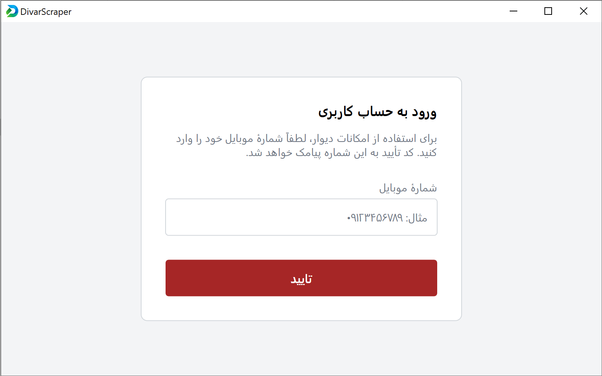
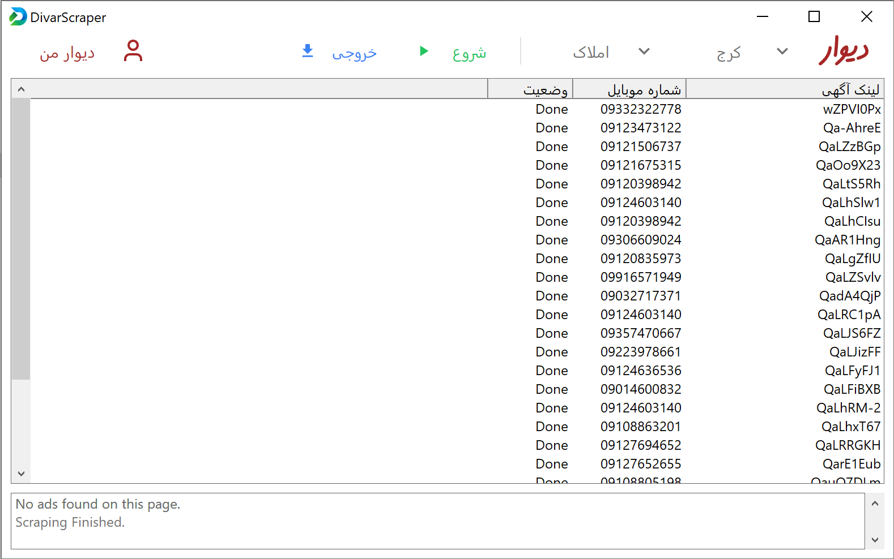

# DivarScraper 🚀

**DivarScraper** is a high-performance C++ desktop application designed to scrape, manage, and analyze advertisements from [Divar](https://divar.ir). Built with a modern Win32 integration and a custom Direct2D rendering engine, it providing a fluid, web-like experience with native speed.


*Modern Dashboard with custom Direct2D Header and Real-time stats*

## ✨ Key Features

- **Modern Web-like UI**: Custom-built header bar using Direct2D/DirectWrite with smooth animations and responsive layout.
- **Smart Scraping**: Intelligent extraction of ad data including titles, prices, descriptions, and metadata.
- **Multi-Level Filtering**: Filter results by City and detailed Categories (Real Estate, Vehicles, Digital Goods, etc.).
- **Native Authentication**: Full integration with Divar's login flow (Phone Number -> SMS Verification).
- **SQLite Integration**: Robust local storage to keep your scraped data persistent and searchable.
- **CSV Export**: Easily export your collected data for further analysis in Excel or other tools.
- **Optimized Binary**: Highly tuned build process resulting in a tiny 1.3MB standalone executable.


*Secure Login flow with Direct2D rendered input fields*

## 🛠 Technical Stack

- **Core**: C++17
- **Graphics**: Direct2D, DirectWrite (Hardware accelerated)
- **Database**: SQLite3 (Embedded & Optimized)
- **Network**: WinHTTP (Native Windows stack)
- **UI Engine**: Custom Win32 framework with DPI-aware layouts

## 🚀 Getting Started

### Prerequisites

- Windows 10/11
- Visual Studio 2022 (with "Desktop development with C++")

### Build Instructions

1. Clone this repository.
2. Open **Developer Command Prompt for VS**.
3. Run the optimized build script:
   ```cmd
   build.bat
   ```
4. Find your optimized `DivarScraper.exe` in the root folder.

## 📂 Project Structure

- `src/`: Core source files (`main.cpp`, `NetworkClient`, `Database`, `LayoutEngine`, etc.)
- `assets/`: Application icons (`icon.ico`), UI assets, and resource scripts.
- `bin/`: Intermediate build files (automatically managed).

## ⚖️ License

Distributed under the MIT License. See `LICENSE` for more information.
